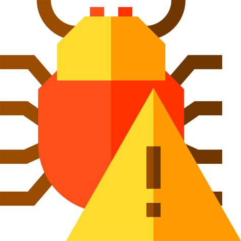

[`Backend con Python`](../Readme.md) > `Sesión 08`
# Sesión 8: Debug, Testing y Seguridad

## :dart: Objetivos

- Hacer uso de las herramientas de test con las que cuenta Django
- Aplicar las características de seguridad en Django

## 📂 Organización de la clase
***
#### <ins>Tema 01: Debug & Testing</ins>

Realizar pruebas a una aplicación nos asegura buena calidad de la misma y verifica que hace lo que se supone debe de hacer. Aunque el testing (o pruebas) puede confundirse un poco con la depuración (debugging), cabe mencionar que este segundo término se refiere al proceso de encontrar y eliminar un error específico en el programa mientras que el primero se hace para encontrar defectos y demostrar un nivel adecuado del software.

El debugging o depuración es el nombre que se le da al proceso de encontrar y eliminar los errores que pueden cometer softwares y hardwares.

   - [**`EJEMPLO 01: Descripción general de la estructura de prueba.`**](Ejemplo-01)
   - [**`EJEMPLO 02: Test de Modelos.`**](Ejemplo-02)
   - [**`EJEMPLO 03: Test de Formularios`**](Ejemplo-03)
   - [**`EJEMPLO 04: Test de Vistas.`**](Ejemplo-04)

***
#### <ins>Tema 02: Seguridad</ins>

Por último, hablaremos sobre la seguridad, los diferentes ataques y/o amenazas que existen y las herramientas que ofrece Django para contrarrestarlas. Con esto podrás mejorar la calidad de tu aplicación.

Proteger los datos de los usuarios es una parte esencial de cualquier diseño de un sitio web.  La buena noticia para los usuarios de Django es que muchas de las amenazas más comunes son manejadas por el framework.

   - [**`EJEMPLO 05: Secuencias de comandos entre sitios (XSS).`**](Ejemplo-05)

### Postwork :memo:
Aplica lo todo lo que aprendiste durante la sesión siguiendo un proyecto guiado.

- [**`POSTWORK SESIÓN 8`**](Postwork/Readme.md)

